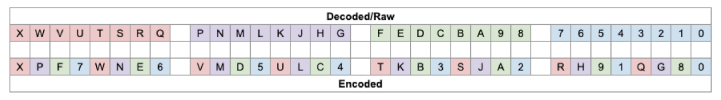
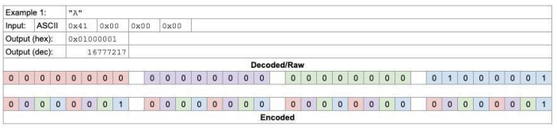
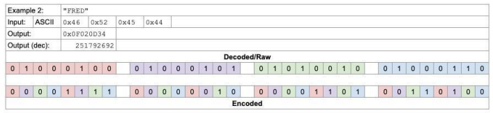
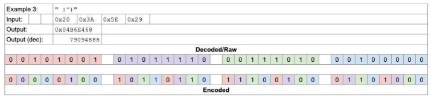
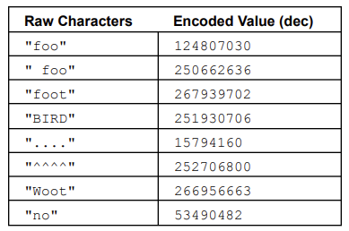

# The Art+Logic Programming Challenge

### Part 1: The Weird Text Format (8-bit)

  
A recurring theme in Art+Logic projects is the need to process data that is provided in unusual or proprietary formats, regardless of whether a project is targeting desktop, mobile, embedded, or the web, so asking applicants to demonstrate their ability to work with low-level data formats is a traditional initial step.

  
For this challenge, we'll use a made-up format that encodes bundles of 4 characters by scrambling them into 32-bit integer values for transmission, then reverses the operation on the receive end to reconstitute the original text. The below image shows how the individual bits in the original raw text (top row) are mixed together into the 32-bit output value on the bottom row:

##### NOTE that in this image, the 0-9 and A-X are only used to identify individual bit positions within the 32-bit data. The position labeled 0 is the least significant bit of the data, X is the most significant bit.
  
If this exercise seems contrived based on your experience, consider that it's at least vaguely similar to real-world things like Reed-Solomon error correction codes or some interleaved data formats that might be transmitted by IoT edge devices. Some examples should make things more clear. 

**Example 1: Single Character**

 
When encoding a chunk with fewer than four characters, the input should be zero-padded to a length of four before encoding. The first character in the input is treated as the least significant byte in the example images:

**Example 2: Full Bundle**

Here we see a complete chunk of 4-characters—refer to a table of ASCII character values to see how the incoming text data is shifted into the Decoded/Raw buffer, and follow the individual bits into their final positions.

**Example 3: Non-Alphanumerics**

  
Another simple example with some characters outside of the regular alphanumeric range:

**More examples**

### The Task

  
The task for part 1 of this challenge is to write just enough code to unlock the rest of it. We expect that a skilled developer should be able to implement the encoding step of this in an hour or so using the above diagrams and example data. Create a bit of code that can encode a single 4-character block of text as described above. 

---

### Part 2: Weird Text Format-8, Continued

Once again, the scramble/descramble matrix for the protocol looks like this:

Refer to the part 1 document for details and examples of the encode/decode process for individual chunks of data. 

The task for part 2 of this challenge is to create a small application that is able to:

*   convert a string of arbitrary length into the corresponding list of integer values
*   convert a list of integer values back into the original string

  
For any valid string input s and your two functions named encode and decode, we expect to be able to successfully assert `s == decode(encode(s))`.

Your code to perform the encoding/decoding of data should be structured as if it were in a library, not tightly coupled to your demo application. Assume that our reviewers will want to import your code and/or call your code from a pre-existing test harness. This program should also offer a simple interface. Examples include a command line application that reads from stdin or a file and writes to stdout or a file, or a web page or mobile/desktop app that uses a text edit box to accept input values by typing or pasting (or loading a file) and a button to convert that input into the desired output format. Your goal here isn't to write code that does the bare minimum of work to produce a correct answer; we're looking to get a taste of what your habits and instincts are for writing production-quality code.

  
At Art+Logic, production-quality code is expected to include useful tests, documentation that includes at least an explanation of what the project is attempting to accomplish and how to use it, appropriate commenting throughout the code and consistent style.

**Example Data**

  
_String_: tacocat  
_Encoded_: \[267487694, 125043731\]

  
_String_: never odd or even  
_Encoded_: \[267657050, 233917524, 234374596, 250875466, 17830160\]

  
_String_: lager, sir, is regal  
_Encoded_: \[267394382, 167322264, 66212897, 200937635, 267422503\]

  
_String_: go hang a salami, I'm a lasagna hog  
_Encoded_: \[200319795, 133178981, 234094669, 267441422, 78666124, 99619077, 267653454, 133178165, 124794470\]  
 

_String_: egad, a base tone denotes a bad age  
_Encoded_: \[267389735, 82841860, 267651166, 250793668, 233835785, 267665210,  
99680277, 133170194, 124782119\]

